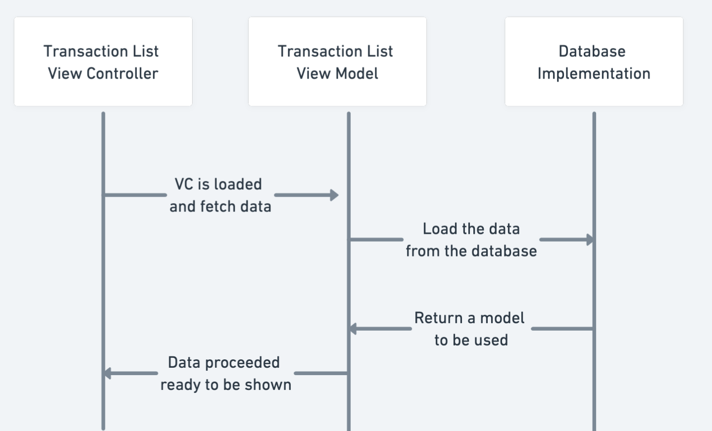
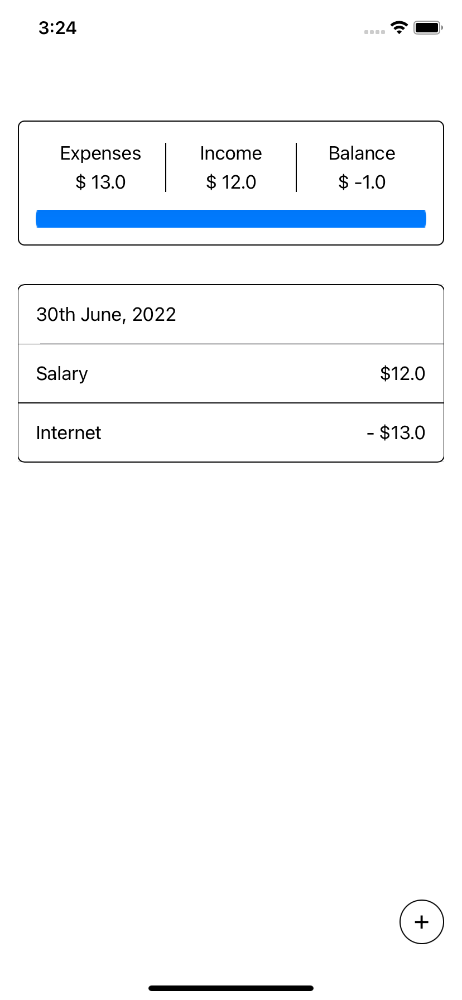
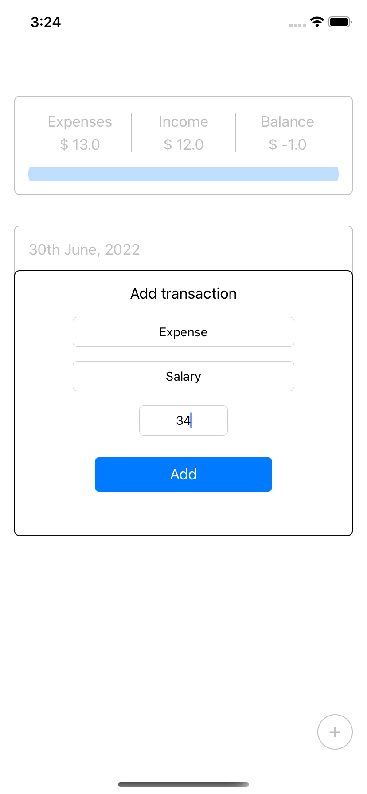
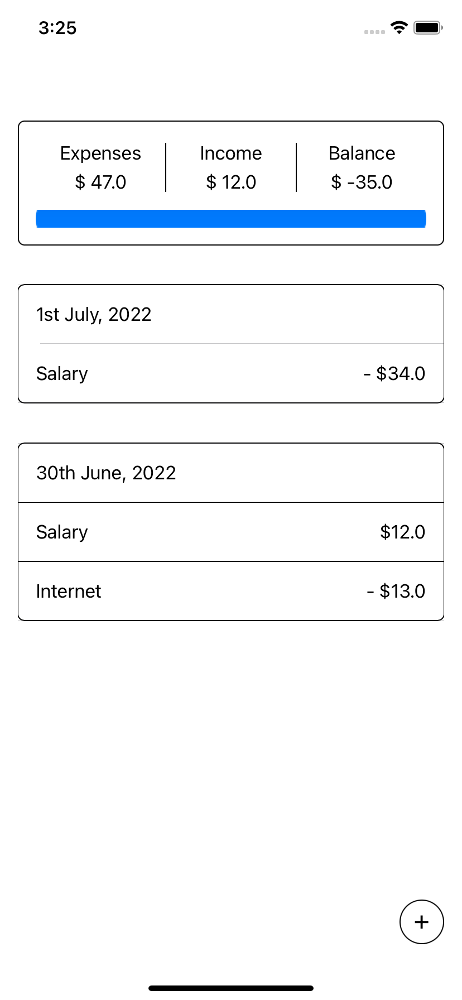
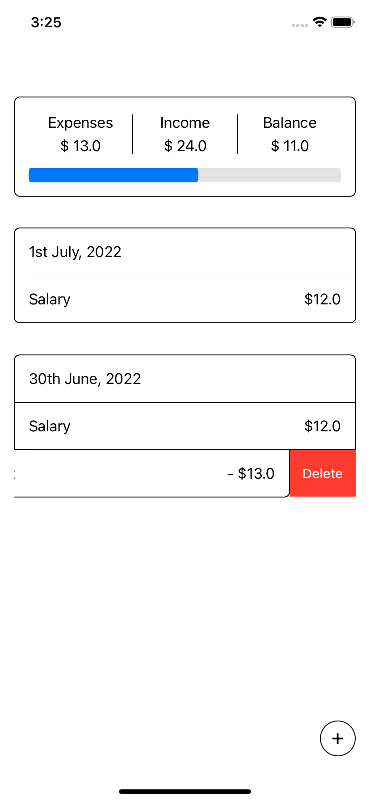

# Expenses-report

Test code to practice MVVM and Repository

## The idea behind TransactionList

The whole project is a test of using MVVM, something I never use in IOS, and having a Database to store the data acting
as a repository pattern.

Here is a simple flow of what I have in mind:

## Use the app
The app is simple. Add a new transaction, with the + button. And then you can swipe to delete it.

## AddTransaction

This controller was much easier and didn't need an interaction directly with the database. So I decided to use a simple
MVC pattern, using a delegate return the created object to the ListController.

## Things to improve

### Realm

This is my first time using realm, so there must be a lot of things to improve there.

### Delete things

I don't feel comfortable with the solution on how to delete a row. I did not store on the Model, so I must find the ID
to be te deleted using the `indexpath`.

### Add the possibility to pick a date and not be auto assigned
Right now, a new `Date.now` is used every time a transaction is added. Put a DatePicker in the screen

## Screens

| Transaction list                        | Add transaction                       |
|-----------------------------------------|---------------------------------------|
|      |  |
|  |          |
